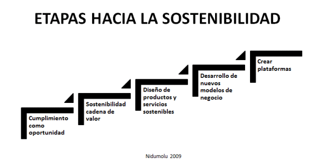
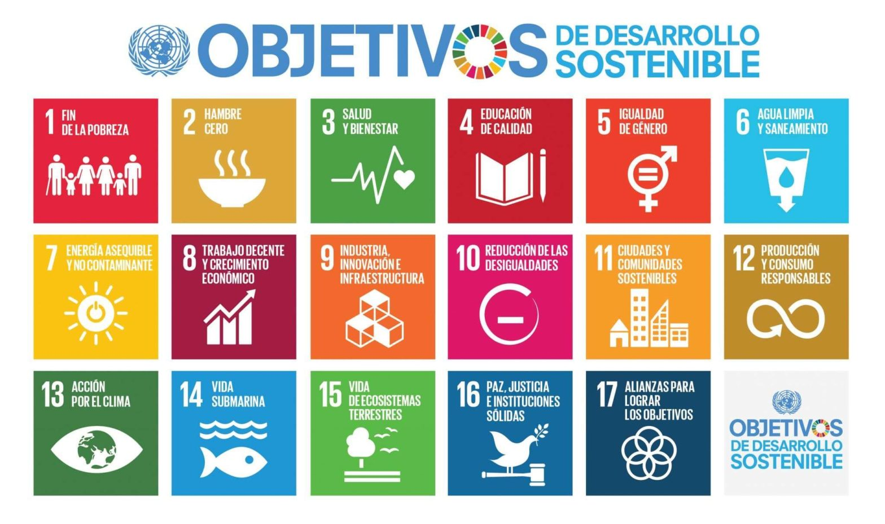
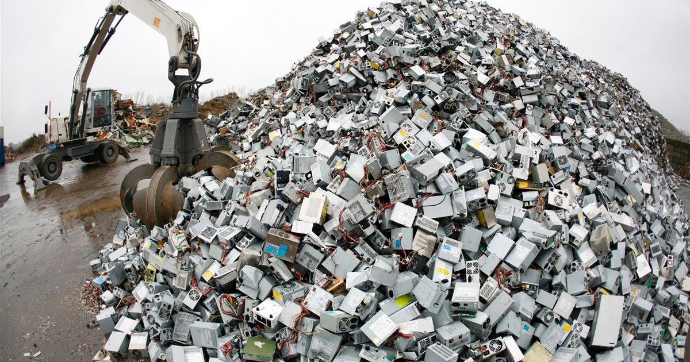
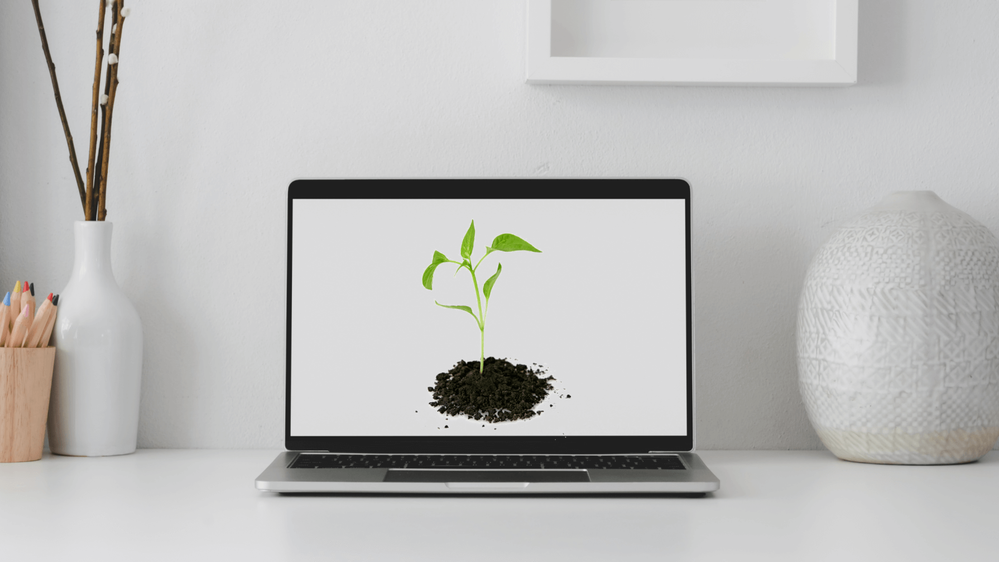
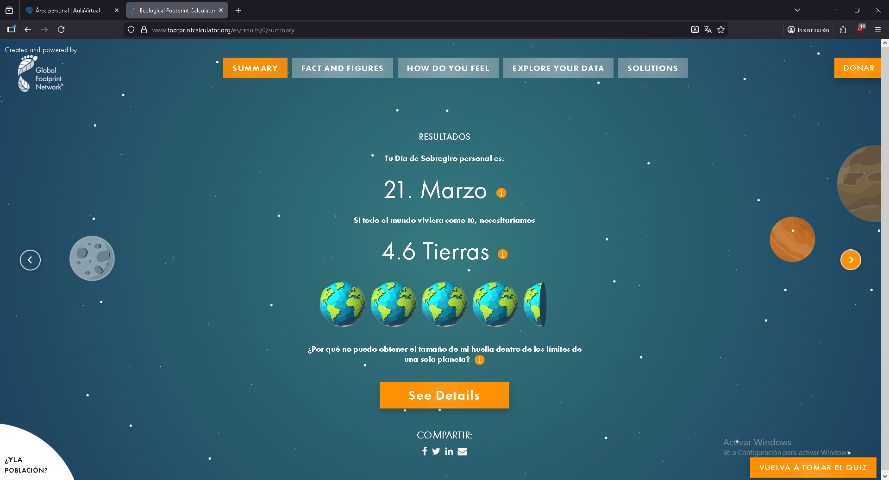
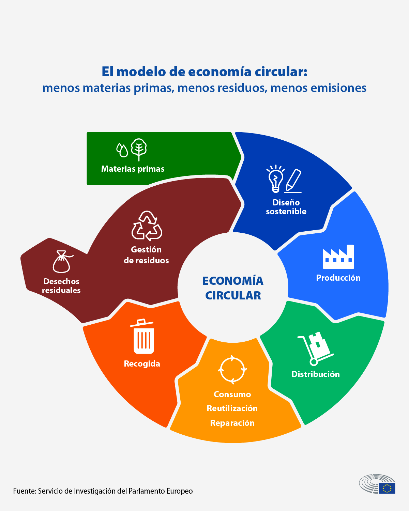
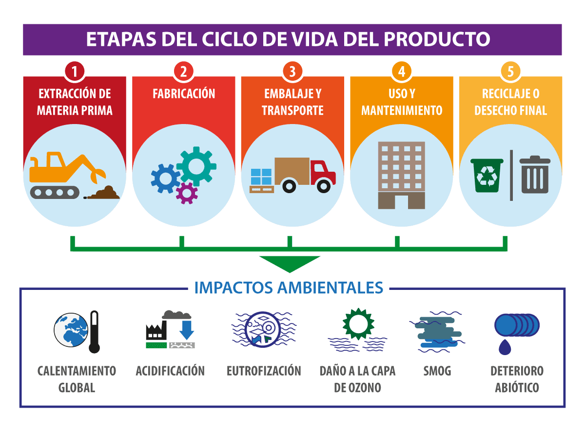

# Bitácora: 23/01/2026
## RESUMEN DE LA CLASE
### Un plan sostenibilidad empresarial se centra en hacer que el proceso de producción de esta sea facil de mantener. La sostenibildad no es una opción, es una condición de supervivencia. La economía no existe en el vacío, las empresas dependen de ecosistemas sanos y de sociedades funcionales. Hay 4 partes en un plan de sostenibilidad: diagnostico inicial (identificamos el problema), hablar con los grupos de interés(¿A quién afectamos y quién nos afecta?), materialidad  (¿Qué es lo prioritario), Acción y Métricas (objetivos medibles y reporte transparente). Al final de todo el proceso SIEMPRE tiene que haber un informe.
## PREGUNTA DE HOY
### ¿Estos planes de sostenibilidad son 'greenwashing', o son utiles de verdad?
### En teoría si, los planes de sostenibilidad on fundamentales y muy útiles en las empresas modernas, ya que no solo mejoran la reputación de marca, sino que también generan ahorro de costes mediante la eficiencia de recursos, garantizan el cumplimiento normativo para evitar sanciones y atraen inversores.
## Imagen

  

# Bitácora: 16/01/2026
## RESUMEN DE LA CLASE
### La agenda 2030 son un conjunto de Objetivos de Desarrollo Sostenible que se tienen previsto cumplir para 2030. Una de las consecuencias de estos ODS es, por ejemplo, la inversión en el sector educativo con la apertura de varios ciclos formativos. Estos ODS se agrupan en 3 grupos: Social, Ambiental y Económica y de Gobernanza. Por ahora de estos objetivos no se han cumplido ni la mitad.
## PREGUNTA DE HOY
### ¿Se van a conseguir los ODS? ¿El hecho de que vayan a conseguir o no tiene importancia?
### Honestamente me parece imposible actualmente, no solo por el hecho de que de estos "Objetivos" que se propusieron en 2015 no se han cumplido ni la mitad, si no también por el clima político y económico actual. El hecho de que estos ODS no se vayan a cumplir obviamente tiene mucha importancia, si estos ODS se hubieran cumplido es indudable que la calidad de vida en general sería 10 veces superior a la actual.
## Imagen

  

# Bitacora: 09/01/2026
## RESUMEN DE LA CLASE
### Los residuos son aquellos desechos que la sociedad no ha encontrado utililidad asi que se tienden a acumular. Muchos de los residuos electronicos que producimos van a parar a paises tercer mundistas como ciertas partes de Africa. Los microplasticos causan muchos problemas en el cuerpo humano debido al impacto que tienen en nuestras hormonas, ademas la propia naturaleza funciona de tal modo que los animales de los cuales nos alimentamos también comen microplasticos. La ropa de poliester dado que es un derivado del plastico tarda siglos en biodegradarse. A dia de hoy los residuos electronicos son aprovechados en gran parte del mundo porque de estos se sacan muchos recursos utiles pero el problema de contaminación con los residuos restantes sigue siendo el mismo.
## PREGUNTA DE HOY
### ¿Por qué cambiaste tu ultimo movil?
### El movil que tengo actualmente pertenecía a mi madre pero ella consiguió otro mejor asi que yo me quede con el suyo antiguo (que era mejor que el mio), mi movil antiguo creo esta guardado en mi casa no lo vendimos ni lo reciclamos.
## Imagen

  

# Bitacora: 12/12/2025
## RESUMEN DE LA CLASE
### Cambio Climático: El cambio climático representa una serie de problemas medioambientales lo cuales también pueden llegar a crear una serie de conflictos internacionales por la obtención de recursos. Las pruebas de que esto es así son irrefutables, la mitad de la población mundial esta en zonas vulnerables al cambio climático lo cual causa una cascada de fallos relacionados con el agua, alimentos y migraciones. Por los cambios de temperatura muchas especies que no formaban parte de nuestro ecosistema antes, migran aqui causando problemas. En el paronama geopolítico actual hay muchos conflictos por recursos no renovables que son esenciales. Se estan, ahora, invirtiendo dinero y recursos en buscar formas de mitigar la consecuencias del cambio climático.
## PREGUNTA DE HOY
### ¿Cuál es el principal emisor de CO2? ¿Qué medidas sostenibles crees tu que podrias adoptar en tu sector laboral como programador?
### El principal emisor de CO2 en el planeta es la quema de combustibles fosiles, siendo los mayores exponentes de esto China y Estados Unidos. Como programador la principal actividad para reducir el consumo energetico es el desarrollo de softwafre sostenible mediante practicas como: uso de recursos renovables como green hosting, implementación de algoritmos energeticamente eficientes,  la integración y monitorización continuas, etc.
## FUENTES UTILIZADAS: https://smowl.net/es/blog/software-sostenible/#elementor-toc__heading-anchor-3
## Imagen

  

# Bitacora: 05/12/2025
## RESUMEN DE LA CLASE
### Huella Ecológica y Huella de Carbono, estas huellas tratan de medir el impacto que los seres humanos tienen en el planeta, se pueden medir tanto en hectareas globales y con un metodo de banco (¿estamos gastando mas recursos de los que podemos generar?). La huella de carbono es la cantidad total de CO2 que se emite, esto sirve tanto para a nivel individual como a nivel global. A dia de hoy tambien se mide la cantidad de planetas que podemos llegar a necesitar en base a las huellas mencionadas anteriormente. 
## ACTIVIDAD DE HOY: En footprintcalculator responder a las preguntas y poner la imagen resultante:
## Imagen

  

## REFLEXIÓN
### La verdad me ha sorprendido el resultado de mi test, considero que mi estilo de vida es bastante normal y que en mi casa no se consumen muchos recursos y eso es algo que he querido reflejar en el test obviamente pero aún asi no me esperaba este resultado. Es evidente que subestimé por bastante el impacto medioambiental que cada individuo puede tener, pero no estoy seguro que medidas se podrian adoptar a nivel individual para contrarestrar esto.

# Bitacora: 28/11/2025
## RESUMEN DE LA CLASE
### Explicación de Economía Lineal y Economía Circular. Siempre se han reutilizado residuos cuando el valor de estos era evidente (Ej. Chatarra de un coche). Es cierto que antes no se reutilizaban tantos recursos como hoy, en ese aspecto la economía ha cambiado. Ahora se tienen en cuenta mas los Principios Clave de Circularidad.
## PREGUNTA DE LA SEMANA: ¿En que me afecta a mi el ecodiseño a nivel individual? ¿Es mejor un enfoque colectivo o individual al aplicar medidas de economía circular?
### A nivel individual he notado que me afecta a la hora de comprar ciertos productos, como por ejemplo ahora todas las botellas tienen tapones que no pueden tirar y las pajitas que hacen ahora de papel. En cuanto a los tipos de enfoque a la hora de aplicar medidas de economía circular, un enfoque colectivo aplicado a las empresas siempre será mucho mas efectivo que un enfoque individual. Porque da igual lo mucho que le digas al ciudadano que recicle y reutilize, si una empresa no tiene ningún tipo de restricción a la hora de, por ejemplo, vertir desechos, el impacto medioambiental que pueda hacer un ciudadano es insignificante en comparación con el impacto que hace esa empresa a diario.
## Imagen

  

# Bitacora: 14/11/2025
## RESUMEN DE LA CLASE
### Una diferencia principal entre nosotros y otras especies es que nosotros utilizamos herramientas. La elaboración de ciertas herramientas puede tener consecuencias en el medio ambiente. La metodología para averiguar el peso oculto(materiales empleados en la elaboración) de cada herramienta se llama Analisis de Ciclo de Vida. Las dos fuentes de energia principal son la energía solar y la energía nuclear. 
## Ejemplos
### 1. Un telefono pesa mcuho menos que el conjunto de materia prima requerida para su elaboración
## Reflexión
### PREGUNTAR A UNA IA SOBRE EL PASO DE FABRICACIÓN DEL ANÁLISIS DE CICLO DE VIDA
### Respuesta de la IA: 
En el Análisis de Ciclo de Vida (ACV) de un teléfono móvil, la etapa de fabricación es una de las más críticas porque concentra gran parte del impacto ambiental. Aquí tienes los puntos clave:
1. Extracción y procesamiento de materias primas

Se requieren metales como litio, cobalto, níquel, cobre, oro y tierras raras para baterías y componentes electrónicos.
La minería es altamente intensiva en energía y agua, y genera emisiones de CO₂, además de impactos sociales (condiciones laborales, conflictos por recursos).

2. Producción de componentes

Pantalla: Fabricación de vidrio, plásticos y circuitos para pantallas OLED o LCD.
Batería: Procesamiento químico para celdas de ion-litio.
Circuitos y chips: Procesos de alta precisión que requieren litografía y ambientes controlados, con consumo elevado de energía.

3. Montaje del dispositivo

Ensamblaje en plantas industriales, generalmente en países con mano de obra intensiva.
Consumo energético menor que la producción de componentes, pero relevante por la escala.

4. Impactos ambientales asociados

Huella de carbono: La fabricación representa entre el 60% y 80% de las emisiones totales del ciclo de vida del móvil.
Consumo de agua: Especialmente en la producción de semiconductores.
Residuos tóxicos: Productos químicos usados en la fabricación de chips y baterías.

5. Estrategias para reducir impacto

Uso de materiales reciclados.
Optimización del diseño para alargar la vida útil.
Energía renovable en fábricas.
Economía circular (reparación, reutilización, reciclaje).
## Imagen

  

## Bitacora: 31/10/2025
### Hoy hemos visto como la consumición de recursos afecta no solo el area medioambiental sino también el ambito social y economico.

## Bitacora: 24/10/2025
### Hoy hemos visto las dos estrategias de crecimiento k y r. Dependiendo de la especie pueden reproducirse de manera mas lenta y tener mas cuidado parental(K) o reproducirse en masa y no tener cuidado parental alguno.
### ¿QUÉ ESTRATEGIA USAMOS LOS SERES HUMANOS?
### El ser humano siempre ha usado la estrategia K en la manera en la que nos reproducimos y nos relacionamos con el entorno

## Bitacora: 17/10/2025
### Hoy hemos hablado de como los seres vivos conviven con otros
### ¿QUÉ HACEMOS NOSOTROS: COOPERAMOS O COMPETIMOS?
### Como seres humanos hemos tenido mucha historía tanto de cooperación como de competir por recursos. Actualmente en general nos encontramos en un estado de cooperación y compartimos recursos con otros.

## Bitacora: 10/10/2025
### Hoy hemos de que es la capacidad de carga en el ecosistema y los factores que la determinan.
### ¿HAY UN LÍMITE PARA LA POBLACIÓN HUMANA?
### Como con todas las especies, hay un limite para la extensión de la población. Como de cerca estamos de ese limite depende de la zona en la que estemos, pero en general es cierto que hay algunos recursos que estan empezando a escasear.

## Bitacora: 03/10/2025
### Hoy hemos visto una breve explicación sobre como nos diferenciamos de otros seres vivos, depués he decido con mi equipo de que civilización vamos a realizar nuestro trabajo (Sumerios) y tambien hemos establecido el directorio grupal para el trabajo.

### ¿ACABAREMOS CON LA VIDA EN NUESTRO PLANETA?
### No creo que eso sea posible, incluso con las armas de destrucción masiva que hay actualmente siempre quedaría alguna forma de vida, ya sean organismos microscopicos o insectos.

## Bitacora: 26/09/2025
### Hoy hemos hablado de los conceptos basicos de sostenibilidad y despues he configurado el entorno de trabajo y el repositorio github que voy a usar.